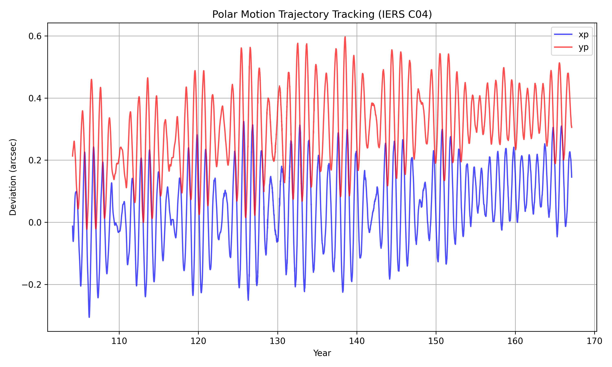
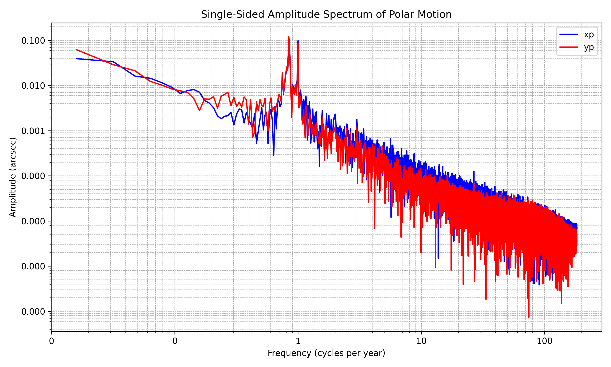

# Geodesy-EOP-Analysis-Python

[](https://www.python.org/downloads/)
[](LICENSE)

Python toolkit for downloading, parsing, and analyzing **Earth Orientation Parameters (EOP)** from the IERS C04 dataset — including polar motion spectral analysis, Chandler Wobble isolation via FFT, and UT1–UTC time scale conversions.

## Physical & Mathematical Background

Earth's orientation is not fixed relative to inertial space or even its own crust. The `EOPManager` and `EOPAnalyzer` classes abstract the retrieval and spectral analysis of the IERS C04 celestial reference frame datasets.

### 1. Polar Motion ($x_p, y_p$)
Polar motion describes the movement of Earth's rotational axis relative to the crust. The two dominant periodic signals are the **Annual Wobble** (seasonal mass redistribution) and the **Chandler Wobble** (~433-day free nutation).

The analyzer isolates the Chandler Wobble by applying a **Fast Fourier Transform (FFT)**, filtering the frequency band $f \in [0.7, 1.0]$ cycles/year to determine the free nutation amplitude.

### 2. Time Scales ($UT1 - UTC$)
Because Earth's rotation rate fluctuates, Universal Time ($UT1$) slowly drifts from Coordinated Universal Time ($UTC$). The analyzer interpolates the $UT1-UTC$ offset from IERS datasets — critical for high-precision GNSS processing and orbit determination.

## Installation

```bash
git clone https://github.com/AmrFawzy-NavEng/Geodesy-EOP-Analysis-Python.git
cd Geodesy-EOP-Analysis-Python
pip install -r requirements.txt
```

## Quick Start

```python
from geodesy_eop import EOPManager, EOPAnalyzer

# Download and load IERS C04 dataset
manager = EOPManager()
data = manager.load()

# Analyze Chandler Wobble
analyzer = EOPAnalyzer(eop_data=data)
spectrum = analyzer.polar_motion_spectrum()
print(f"Chandler period: {spectrum['chandler_period_days']:.1f} days")
print(f"Chandler amplitude: {spectrum['chandler_amp_arcsec']:.4f} arcsec")

# Convert UTC to UT1
mjd_ut1, offset = analyzer.convert_utc_to_ut1(target_mjd=60000.0)
```

## Example Output

Run `python examples/ex02_eop_analysis.py` to automatically download the IERS dataset, extract the Chandler wobble, and generate publication-quality plots:





## Project Structure

```
Geodesy-EOP-Analysis-Python/
├── geodesy_eop/
│   ├── __init__.py    # Package exports
│   └── eop.py         # EOPManager (download/parse) + EOPAnalyzer (FFT/time scales)
├── examples/
│   └── ex02_eop_analysis.py
├── requirements.txt
└── LICENSE
```

## Data Source

EOP data is automatically downloaded from the [IERS Earth Orientation Centre](https://hpiers.obspm.fr/iers/eop/eopc04/) (public, freely available).

## License

MIT — see [LICENSE](LICENSE) for details.
